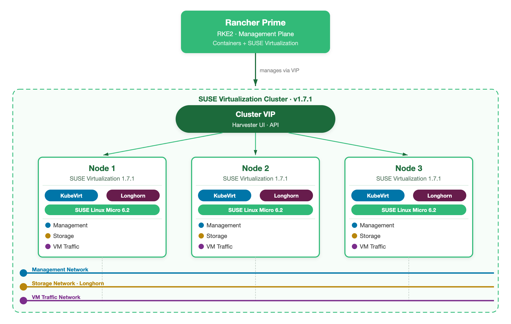

# SUSE Virtualization: 0 to Hero
### A hands-on guide from first login to running Kubernetes on your HCI cluster

---

## What This Guide Covers

Five labs. Each one builds on the last. By the end you will have navigated the full SUSE Virtualization stack: created VMs, configured networks, taken snapshots, and migrated workloads live between nodes without downtime.

Each lab has two parts:
- **Demo**: a Storylane recording showing the UI flow step by step. Watch it first.
- **Hands-on**: the steps to follow yourself on your own environment.

No prior Harvester experience needed. Familiarity with basic Linux and Kubernetes concepts helps but is not required.

---

## What Is SUSE Virtualization?

SUSE Virtualization (also called Harvester) is an open-source HCI platform built on Kubernetes. Instead of running a hypervisor kernel like ESXi and bolting Kubernetes on top of it, SUSE Virtualization runs KVM virtual machines as Kubernetes workloads using KubeVirt. Everything is a Kubernetes resource: VMs, networking, storage, and the platform itself.

This matters because it means:
- You manage VMs the same way you manage containers: with kubectl, YAML, and GitOps if you want it.
- Storage (Longhorn) is distributed across all nodes with no external SAN required.
- Networking (Kube-OVN + Multus) supports both flat L2 bridges and full SDN with isolated subnets.
- Rancher Prime manages the Harvester cluster the same way it manages any other downstream cluster.

| Traditional Hypervisor | SUSE Virtualization |
|------------------------|---------------------|
| Proprietary hypervisor kernel | KVM + KubeVirt (open source) |
| External SAN or vSAN | Longhorn (distributed, built in) |
| NSX or distributed switch | Kube-OVN + Multus |
| Separate management plane | Rancher Prime |

---

## Architecture at a Glance



The reference topology for this lab series: Rancher Prime manages a 3-node SUSE Virtualization cluster through a cluster VIP. Each node runs SUSE Linux Micro 6.2, with KubeVirt for VM scheduling and Longhorn for replicated block storage. Three networks keep traffic separated: Management for control plane communication, Storage for Longhorn replication, and VM Traffic for guest VM connectivity.

**Rancher Prime** sits outside the cluster as a dedicated management node running RKE2. It connects to the Harvester cluster via the VIP and acts as the single control point for cluster lifecycle, RBAC, observability, and guest Kubernetes provisioning.

**Cluster VIP** is a floating IP backed by kube-vip. The Harvester UI, the API endpoint, and the Rancher management channel all go through it. When a node goes down, the VIP moves. No external load balancer required.

**Three nodes** form the HA control plane quorum automatically. KubeVirt schedules VMs across nodes. Longhorn keeps three replicas of every volume by default. A node failure does not take down VMs or storage.

---

## Lab 1: UI Orientation

**Duration:** ~5 minutes  
**Goal:** Navigate the Harvester UI and understand what each section does before touching anything.

### Concepts

- **Dashboard**: live cluster health: node count, CPU/memory pressure, VM count, storage capacity.
- **Virtual Machines**: list of all VMs, their node placement, state, and console access.
- **Hosts**: the physical (or virtual) nodes that make up the cluster. Each node runs KVM + Longhorn + Kube-OVN.
- **Volumes**: Longhorn block volumes backing VM disks. Replicated across nodes.
- **Networks**: VM-facing networks. `mgmt` is the built-in management bridge. You add more.
- **Images**: OS images available for VM creation (qcow2, ISO).
- **Advanced**: storage classes, settings, SSH key pairs, cloud-init templates.

### Demo Recording Guide (Storylane)

> Record from the Harvester dashboard. No changes to the system. This is a tour only.

| Step | Where to click | Tooltip text |
|------|---------------|--------------|
| 1 | Dashboard (left nav) | "This is your cluster at a glance. Node health, resource pressure, and VM count update in real time." |
| 2 | Hosts (left nav) | "Each host is a node in the cluster. Click one to see CPU, memory, and which VMs are running on it." |
| 3 | A host row → click name | "You can see the exact resources allocated vs. available per node. Longhorn reports disk health here too." |
| 4 | Virtual Machines (left nav) | "All VMs in the cluster. State, node placement, IP, and a direct VNC/SSH console link." |
| 5 | Networks > VM Networks (left nav) | "Networks available to VMs. The mgmt network is always here. You add VLANs and SDN subnets as needed." |
| 6 | Storage > StorageClasses | "Longhorn storage policies. The default gives 3 replicas across 3 nodes. One node can fail without data loss." |
| 7 | Advanced > Settings | "Cluster-wide settings: backup target, VM default namespace, UI plugin config." |

### What Success Looks Like

You can answer these questions without looking anything up:
- How many nodes are in the cluster and what state are they in?
- Where do you go to create a new VM?
- Where do you find the list of storage volumes?

---

## Lab 2: Your First VM

**Duration:** ~10 minutes  
**Goal:** Create a VM from a pre-loaded OS image, watch it start, and connect to it.

### Concepts

- **VirtualMachine (VM)**: a KubeVirt resource. Under the hood it is a Kubernetes pod running QEMU.
- **Volume**: the VM's disk. Cloned from an image at creation time, stored in Longhorn.
- **Cloud-init**: the standard mechanism for injecting SSH keys, users, and scripts into Linux VMs at first boot.
- **VNC console**: browser-based access to the VM's screen, useful before SSH is configured.

### Demo Recording Guide (Storylane)

> Start from Virtual Machines. You need a pre-loaded image (openSUSE Leap 15.6 or any cloud image).

| Step | Where to click | Tooltip text |
|------|---------------|--------------|
| 1 | Virtual Machines → Create | "Every VM starts here. Harvester will clone the image, create a Longhorn volume, and schedule the VM onto a node." |
| 2 | Name field → type `my-first-vm` | "The VM name becomes a Kubernetes resource name. Lowercase, no spaces." |
| 3 | CPU field → set `2` | "vCPUs are allocated from the node the VM lands on. Overcommit is allowed." |
| 4 | Memory field → set `2` GiB | "Memory is reserved, not overcommitted by default. What you set is what the VM gets." |
| 5 | Volumes tab → Image dropdown → select your image | "Harvester clones this image into a new Longhorn volume. The original image is not modified." |
| 6 | Volumes tab → Size → set `20 GiB` | "This is the root disk size. You can expand it later without recreating the VM." |
| 7 | Networks tab → verify `management Network` is selected | "The VM gets an IP on the cluster management network by default. You'll add more networks in Lab 3." |
| 8 | Advanced → Cloud Config tab → paste SSH key | "Cloud-init runs at first boot and injects your public key. This is how you SSH in." |
| 9 | Click Create | "Harvester creates the KubeVirt VM resource, schedules it, and starts the boot sequence." |
| 10 | VM list → wait for Running state | "The VM is running when KubeVirt reports the pod as Ready. Usually under 60 seconds from a pre-loaded image." |
| 11 | Click VM name → VNC Console tab | "Direct screen access. You can log in here before SSH is available." |

### Hands-on Steps

```bash
# Once the VM is Running and you have its IP from the VM list:
ssh opensuse@<VM_IP>

# Verify it is a real VM with real resources
nproc
free -h
df -h
```

### Verification

- VM shows `Running` in the VM list.
- VNC console shows a login prompt.
- SSH connects successfully.
- `nproc` returns 2, `free -h` shows ~2 GiB.

---

## Lab 3: VM Networking

**Duration:** ~8 minutes  
**Goal:** Create a cluster network, build an untagged VM network on top of it, and attach it to a VM as a second NIC.

### Concepts

- **Cluster Network**: binds to a physical NIC on each node. This is the Layer 2 uplink that VM networks use to reach the rest of your infrastructure.
- **VM Network**: a network attachment definition created on top of a cluster network. Multus + bridge CNI delivers a real L2 interface to the VM. With no VLAN ID set, traffic is untagged.
- **Untagged network**: the VM gets a native (untagged) interface on the physical uplink. No VLAN trunking needed on the upstream switch.

### Demo Recording Guide (Storylane)

> Record three flows: (A) create a cluster network, (B) create an untagged VM network, (C) attach it to a VM.

**Flow A: Create a Cluster Network**

| Step | Where to click | Tooltip text |
|------|---------------|--------------|
| 1 | Networks → Cluster Networks → Create | "A cluster network is the physical uplink. You bind it to a NIC on each node so VM networks have somewhere to send traffic." |
| 2 | Name → `vm-uplink` | "Name it after the role, not the NIC. Makes it easier to move to a different NIC later without renaming." |
| 3 | On each node, select the NIC to bind | "Every node needs a binding. If a node has no binding, VMs using this network cannot run on it." |
| 4 | Click Create | "The cluster network is ready. Now you can build VM networks on top of it." |

**Flow B: Create an Untagged VM Network**

| Step | Where to click | Tooltip text |
|------|---------------|--------------|
| 1 | Networks → VM Networks → Create | "A VM Network is a network attachment definition. It tells Multus how to wire a VM's NIC to the physical uplink." |
| 2 | Name → `flat-net` | "This name is what you pick when adding a NIC to a VM." |
| 3 | Cluster Network → `vm-uplink` | "The physical uplink this network uses. Traffic from VMs exits through the NIC you bound earlier." |
| 4 | Leave VLAN ID empty | "No VLAN ID means untagged traffic. The VM's frames go out as-is on the wire." |
| 5 | Click Create | "The network is available to any VM in this cluster." |

**Flow C: Attach the Network to a VM**

| Step | Where to click | Tooltip text |
|------|---------------|--------------|
| 1 | Virtual Machines → select `my-first-vm` → Edit | " " |
| 2 | Networks tab → Add Network | "You can attach multiple networks to a single VM. Each one becomes a separate NIC inside the guest." |
| 3 | Network dropdown → select `flat-net` | "The VM now has two NICs: its management NIC and a second one on the untagged uplink." |
| 4 | Save and restart the VM | "A restart is the safe path for all OS types to pick up the new NIC." |

### Hands-on Steps

```bash
# After the VM restarts, SSH in and verify the second NIC appeared
ssh opensuse@<VM_IP>
ip addr show

# The second interface (eth1 or similar) is up with no IP yet
# Configure a static address in the same subnet as your uplink
sudo ip addr add 192.168.1.50/24 dev eth1
sudo ip link set eth1 up

# Verify connectivity on the new interface
ping 192.168.1.1
```

### Verification

- `flat-net` appears in Networks → VM Networks.
- The VM has two NICs after restart, visible in `ip addr show`.
- The second interface reaches the gateway on the untagged network.

---

## Lab 4: Storage, Snapshots and Restore

**Duration:** ~10 minutes  
**Goal:** Understand Longhorn storage classes, take a VM snapshot, simulate data loss, and restore to a clean state.

### Concepts

- **StorageClass**: defines the Longhorn replication policy. The default `harvester-longhorn` uses 3 replicas. You can create classes with fewer replicas for less critical data.
- **VM Snapshot**: a point-in-time copy of all VM volumes. Stored in Longhorn. Crash-consistent by default; application-consistent with the QEMU guest agent.
- **Restore**: creates a new VM from a snapshot. The original VM is not touched.
- **Backup target**: snapshots are local. For off-cluster protection, configure an S3 or NFS backup target in Advanced → Settings.

### Demo Recording Guide (Storylane)

**Flow A: Create a custom storage class**

| Step | Where to click | Tooltip text |
|------|---------------|--------------|
| 1 | Advanced → Storage Classes → Create | "Storage classes are Longhorn policies. You pick the replica count and the provisioner does the rest." |
| 2 | Name → `longhorn-2rep` | " " |
| 3 | Number of Replicas → `2` | "2 replicas means one node can fail without losing this volume. Use this for dev/test workloads." |
| 4 | Reclaim Policy → Delete | "When the volume is deleted, the data goes with it. Use Retain for anything you want to keep." |
| 5 | Click Create | "The new class is available immediately. Any new VM or PVC can request it by name." |

**Flow B: Take a snapshot**

| Step | Where to click | Tooltip text |
|------|---------------|--------------|
| 1 | Virtual Machines → `my-first-vm` → ⋮ menu → Take Snapshot | "Snapshots capture all volumes attached to the VM at this instant." |
| 2 | Name → `pre-change-snap` | "Name it to describe the state you are recording, such as before a config change or upgrade." |
| 3 | Click Create | "Longhorn creates a copy-on-write snapshot. No data is duplicated yet. Only divergent writes will consume extra space." |
| 4 | Check VM Snapshots list | "ReadyToUse: true means the snapshot is consistent and can be restored from at any point." |

**Flow C: Restore from snapshot**

| Step | Where to click | Tooltip text |
|------|---------------|--------------|
| 1 | VM Snapshots → `pre-change-snap` → Restore | " " |
| 2 | Select "Create new VM" | "The restored VM is independent. The original VM keeps running, so you can compare them side by side." |
| 3 | New VM name → `my-first-vm-restored` | " " |
| 4 | Click Restore | "Harvester creates a new VM from the snapshot volumes. Both VMs are now live simultaneously." |
| 5 | Show both VMs in the VM list | "This is your rollback path. Once you confirm the restored VM is clean, delete the original." |

### Hands-on Steps

```bash
# Before snapshotting: write something to the VM so you can verify the restore
ssh opensuse@<VM_IP>
echo "this change happened AFTER the snapshot" | sudo tee /tmp/post-snap.txt

# After restoring: SSH into the restored VM
ssh opensuse@<RESTORED_VM_IP>
ls /tmp/post-snap.txt   # should NOT exist — the snapshot predates this file
```

### Verification

- `longhorn-2rep` storage class appears in `kubectl get storageclass`.
- Snapshot shows `ReadyToUse: true`.
- `/tmp/post-snap.txt` does not exist on the restored VM.

---

## Lab 5: Live Migration

**Duration:** ~5 minutes  
**Goal:** Move a running VM from one node to another with zero downtime.

### Concepts

- **Live migration**: KubeVirt moves the running VM's memory state to another node while it keeps running. The VM never stops. The disk stays in Longhorn (shared storage means no data movement needed).
- **When it happens automatically**: when you drain a node for maintenance (`kubectl drain`), all VMs on that node migrate automatically to healthy nodes.
- **Requirements**: the VM image must support live migration (most Linux cloud images do). Windows VMs require the VirtIO balloon driver.

### Demo Recording Guide (Storylane)

| Step | Where to click | Tooltip text |
|------|---------------|--------------|
| 1 | Virtual Machines → `my-first-vm` | "Note which node this VM is currently running on. It is shown in the Node column." |
| 2 | ⋮ menu → Migrate | "Live migration moves the VM to another node without stopping it. The guest OS has no idea this is happening." |
| 3 | Watch the VM row | "Status changes to Migrating briefly, then back to Running on a different node." |
| 4 | Confirm node has changed | "The IP does not change. Any open SSH session stays connected. Storage stays in Longhorn, nothing was copied." |
| 5 | Hosts → original node → show VMs tab | "The VM is no longer listed here. It moved, and the freed resources are available for the next workload." |

### Hands-on Steps

```bash
# Keep an SSH session open during migration to see zero downtime
ssh opensuse@<VM_IP>
ping 8.8.8.8 &   # leave this running

# Trigger migration from the UI, then check: did ping drop any packets?
# You should see zero packet loss across the migration window.
```

### Verification

- VM ends up on a different node than it started on.
- SSH session stays alive through the migration.
- `ping` shows no dropped packets.

---

## The Full Stack

After completing all five labs, you have touched every layer:

```
Physical hardware (or nested KVM for the demo)
  └── SUSE Virtualization (KubeVirt + Longhorn + Multus)
        ├── VMs with untagged L2 networking and replicated storage
        ├── Snapshots and off-cluster backup targets
        └── Live migration with zero downtime
```

Everything here is open source. Everything is SUSE-supported. No proprietary storage array, no separate hypervisor license, no separate network appliance.

---

## Storylane Demo Checklist

Use this to track recording progress.

| Demo | Lab | Status | Notes |
|------|-----|--------|-------|
| UI Orientation | Lab 1 | [ ] | No system changes needed |
| Create First VM | Lab 2 | [ ] | Needs pre-loaded OS image |
| VM Networking | Lab 3 | [ ] | Three flows: cluster network, untagged VM network, attach |
| Storage + Snapshots | Lab 4 | [ ] | Two flows: storage class, snapshot/restore |
| Live Migration | Lab 5 | [ ] | Single flow, keep short |

**Recording tips for Storylane:**
- Record each flow as a separate demo. It's easier to update one without re-recording everything.
- Pause on each confirmation screen so viewers can read the result.
- Keep tooltip text short: one sentence max. The written guide carries the explanation.
- For flows that take time (VM provisioning, cluster bootstrap), cut to the end state rather than recording the wait.
- Add a chapter marker at the start of each flow so viewers can skip to what they need.

---

## Prerequisites for Running These Labs Yourself

| Requirement | Minimum |
|-------------|---------|
| SUSE Virtualization cluster | 3 nodes (can be nested KVM for testing) |
| RAM per node | 16 GiB |
| CPU per node | 4 vCPU |
| Disk per node | 100 GB |
| Rancher Prime | 2.9+ with Harvester UI plugin installed |
| OS image | openSUSE Leap 15.6 or any cloud-init-compatible image, pre-loaded into Harvester |
| Network | VLAN-capable switch (or a flat network for mgmt-only labs) |

For a quick local setup without physical hardware, use the HCIAB (HCI in a Box) approach: a single machine with nested KVM running all three Harvester nodes inside it. See `ARCHITECTURE.md` in this repo for the full setup.
